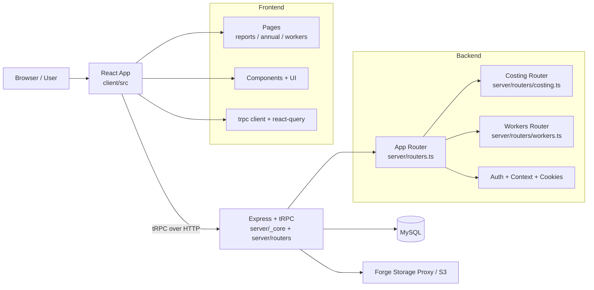

# 藝臻月度核算系統 (Yizhen System Site)

這是一個以月報核算為核心的全端應用，提供：

- 月度成本與利潤核算
- 月報儲存、查詢、刪除
- 年度彙總趨勢檢視
- 鐵工名單維護
- A4 列印版月報輸出

專案採用單一倉庫（Monorepo 風格）管理前後端：前端由 Vite + React 建置，後端由 Express + tRPC 提供 API，資料層使用 Drizzle ORM 搭配 MySQL。

## 技術棧

- Frontend: React 19, Vite 7, TypeScript, Tailwind CSS, Radix UI, Wouter
- Data Fetching: tRPC + TanStack Query
- Backend: Node.js, Express, tRPC
- Database: MySQL + Drizzle ORM + drizzle-kit
- Testing: Vitest
- Build Tooling: esbuild, tsx

## 系統架構



## 目錄說明

```text
.
├─ client/
│  ├─ src/
│  │  ├─ pages/                 # 主要頁面（首頁、月報、年度、鐵工名單等）
│  │  ├─ components/            # UI 與業務元件
│  │  ├─ lib/                   # 計算邏輯、tRPC client、列印輔助
│  │  └─ main.tsx               # 前端入口
│  └─ public/
├─ server/
│  ├─ _core/                    # 伺服器核心（index、trpc context、oauth、vite 整合）
│  ├─ routers/                  # 領域 API（costing、workers）
│  ├─ db.ts                     # DB 存取與查詢封裝
│  └─ routers.ts                # appRouter 聚合
├─ drizzle/
│  ├─ schema.ts                 # 資料表定義
│  └─ *.sql / meta/             # migration 與快照
├─ shared/                      # 前後端共享常數與型別
└─ vite.config.ts               # 前端建置與 alias 設定
```

## 核心資料模型

- `users`: 使用者資訊與角色
- `workerCatalog`: 鐵工名單
- `monthlyReports`: 月報主資料（進出貨、運費、備註等）
- `processingEntries`: 月報加工明細（最多 4 筆）

資料表定義位於 `drizzle/schema.ts`，migration 檔案在 `drizzle/`。

## 本機開發建置方式

### 1. 環境需求

- Node.js 18+（建議 20 LTS）
- pnpm 10+
- MySQL 8+

### 2. 安裝相依套件

```bash
pnpm install
```

### 3. 設定環境變數

請建立 `.env`（可參考 `.env.example`），至少需要：

- `NODE_ENV=development`
- `PORT=3000`
- `JWT_SECRET=<your-secret>`
- `DATABASE_URL=mysql://<user>:<password>@127.0.0.1:3306/<db_name>`

若要啟用 Forge/S3 相關功能，另外設定：

- `BUILT_IN_FORGE_API_URL`
- `BUILT_IN_FORGE_API_KEY`

### 4. 初始化/更新資料庫

```bash
pnpm db:push
```

此指令會執行：

1. `drizzle-kit generate`
2. `drizzle-kit migrate`

### 5. 啟動開發模式

```bash
pnpm dev
```

啟動後會由 Express server 承載 Vite 開發中介層，預設網址：

- `http://localhost:3000`

若 3000 被占用，系統會自動嘗試後續可用 port。

## 測試與品質檢查

```bash
pnpm test      # 執行 Vitest
pnpm check     # TypeScript 型別檢查
pnpm format    # Prettier 格式化
```

## 正式建置與啟動

### Build

```bash
pnpm build
```

產物：

- 前端靜態檔輸出至 `dist/public`
- 後端入口 bundle 輸出至 `dist/index.js`

### Start (Production)

```bash
pnpm start
```

`start` 會以 production mode 啟動 Express，並直接提供 `dist/public` 靜態內容。

## API 與權限概覽

- 路徑前綴：`/api/trpc`
- 主要 Router：
  - `auth`: 登入、登出、當前使用者
  - `costing`: 月報查詢/儲存/刪除、年度彙總
  - `workers`: 鐵工名單查詢/維護/封存
- 權限控制：透過 tRPC middleware（`publicProcedure` / `protectedProcedure`）處理登入驗證

## 常見開發流程

1. 拉取最新程式碼
2. `pnpm install`
3. 準備 `.env`
4. `pnpm db:push`
5. `pnpm dev`
6. 開發完成後執行 `pnpm test` 與 `pnpm check`
7. `pnpm build` 驗證可建置

## 備註

- 專案中包含 `patches/wouter@3.7.1.patch`，安裝相依時會自動套用。
- 若在 Windows 執行腳本，已透過 `cross-env` 處理 `NODE_ENV` 相容性。
